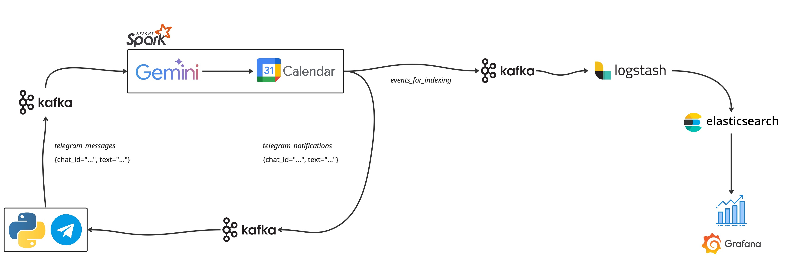

# CalendarTAP

**CalendarTAP** is a university project for *Technologies for Advanced Programming* that allows you to transform simple natural-language messages sent via Telegram into structured events on Google Calendar.

## Architecture
The architecture is the following:



It consists of the following component:
- Telegram Bot: ingests user requests from Telegram and writes them to a Kafka topic.
- Kafka: acts as a resilient message broker, storing raw requests, data for indexing, and final notifications in separate topics.
- Spark: consumes raw requests from Kafka, processes them using Google Gemini and Calendar APIs, and writes enriched data and notifications back to Kafka.
- Logstash: consumes the enriched data topic from Kafka and reliably loads it into Elasticsearch for indexing.
- Elasticsearch: indexes the final, enriched event data, making it searchable and available for analysis.
- Grafana: connects to Elasticsearch to allow for the visualization and monitoring of the processed data via interactive dashboards.

## How to Run the Project
### Step 1: Configure Environment Variables
The project uses a `.env` file to manage credentials:
 - Rename the `env.example` file to `.env`.
 - Open the `.env` file with a text editor and fill in the following values:
    ```env
    # Bot token obtained from BotFather on Telegram
    TELEGRAM_TOKEN=YOUR_TELEGRAM_TOKEN

    # API Key for Google AI Studio (Gemini)
    GEMINI_API_KEY=YOUR_GEMINI_API_KEY

    # ID of the Google Calendar to write events to
    # E.g., 'primary' or 'xxxxxxxxxx@group.calendar.google.com'
    GOOGLE_CALENDAR_ID=YOUR_CALENDAR_ID
    ```

### Step 2: Google Credentials Configuration
The application requires a **Google Cloud Service Account** to securely interact with the Google Calendar API.
1.  **Create the Service Account:**
    - Go to the [Google Cloud Console](https://console.cloud.google.com/).
    - Make sure you are in the correct project.
    - Navigate to **IAM & Admin > Service Accounts**.
    - Click **"+ CREATE SERVICE ACCOUNT"**.
    - Give it a name (e.g., `calendar-bot-service`) and proceed. No specific roles are needed at this stage.

2.  **Generate the JSON Key:**
    - Once the Service Account is created, click on its email address in the list.
    - Go to the **"KEYS"** tab.
    - Click **"ADD KEY"** -> **"Create new key"**.
    - Select **JSON** as the key type and click **"CREATE"**.
    - A JSON file will be downloaded.

3.  **Place the Key:**
    - Rename the downloaded JSON file to `gcp_service_account.json`.
    - Move this file to the following folder within the project: `./spark/credentials/`.

4.  **Share Your Calendar:**
    - Open your [Google Calendar](https://calendar.google.com/).
    - Find your Service Account's email address in the downloaded JSON file (under the `client_email` key).
    - In the settings of the calendar you want to use, share it with the Service Account's email, granting it the **"Make changes to events"** permission.

### Step 3: Start the Environment
1. Start the project with the command `docker-compose up --build`
2. Visit localhost:3000 and login using admin admin for Grafana.
3. Enjoy.